# HackPilot — Showcase

> A visual walkthrough of the HackPilot AI workspace for hackathon teams.

---

## 1. Landing Page

The first impression: a dark, modern landing page that explains the problem HackPilot solves and invites visitors to try the platform.

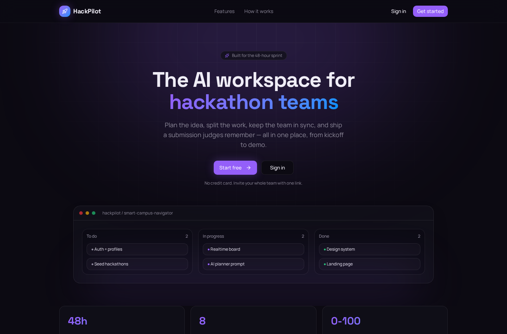

---

## 2. Sign In

Secure authentication with email or Google, powered by Lovable Cloud Auth.

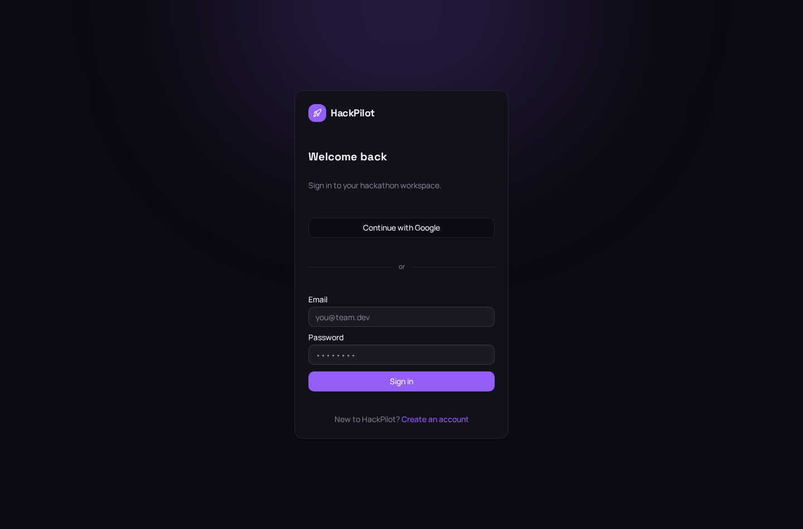

---

## 3. Dashboard

A centralized dashboard showing active hackathons, project progress, upcoming deadlines, and recent team activity.

---

## 4. Create a New Project

Start a new hackathon project by choosing a seeded hackathon or creating a custom one, setting a deadline, and inviting teammates.

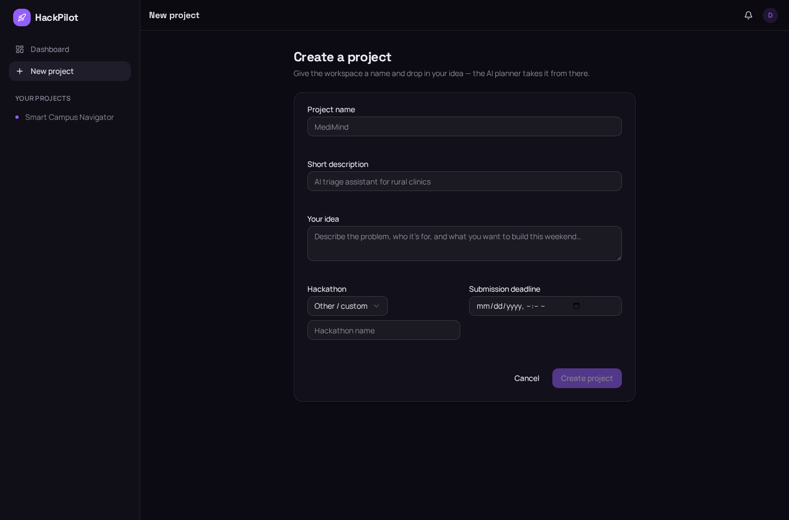

---

## 5. Project Overview

A high-level view of the project: description, tech stack, milestones, and team members.

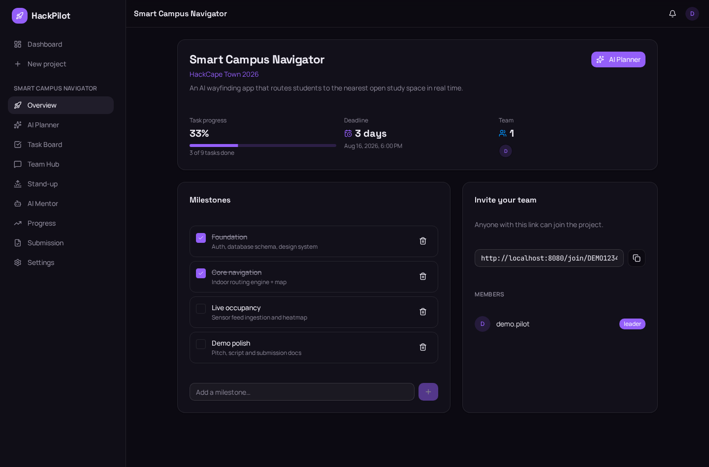

---

## 6. AI Project Planner

Enter an idea and the AI generates a complete plan — summary, tech stack, phases, milestones, and prioritized tasks.

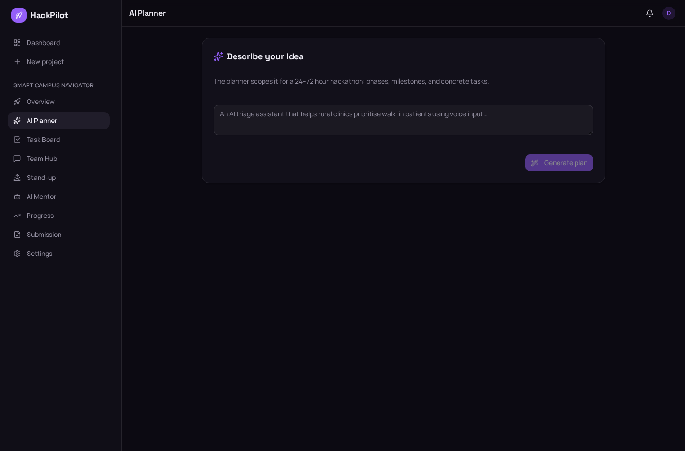

---

## 7. Kanban Task Board

Drag-ready columns (Backlog, To Do, In Progress, Review, Done) with priority badges, assignees, due dates, and labels.

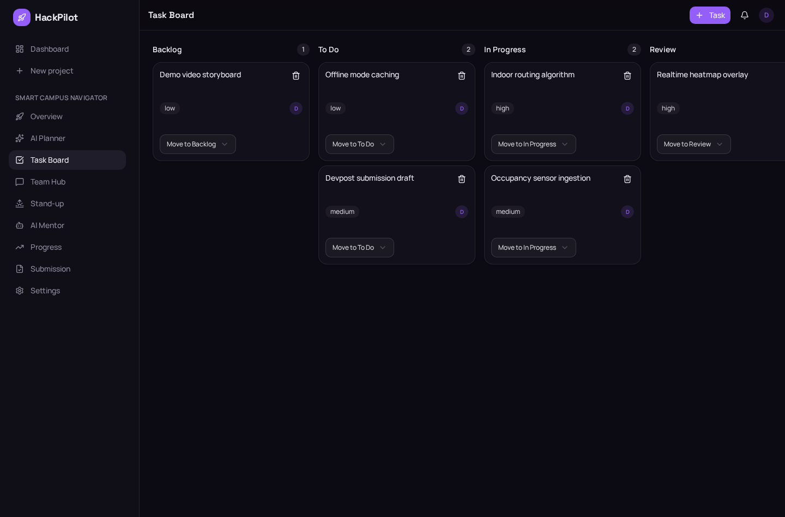

---

## 8. Team Hub

Real-time team discussion with @mentions, shared scratchpad notes, and file uploads.

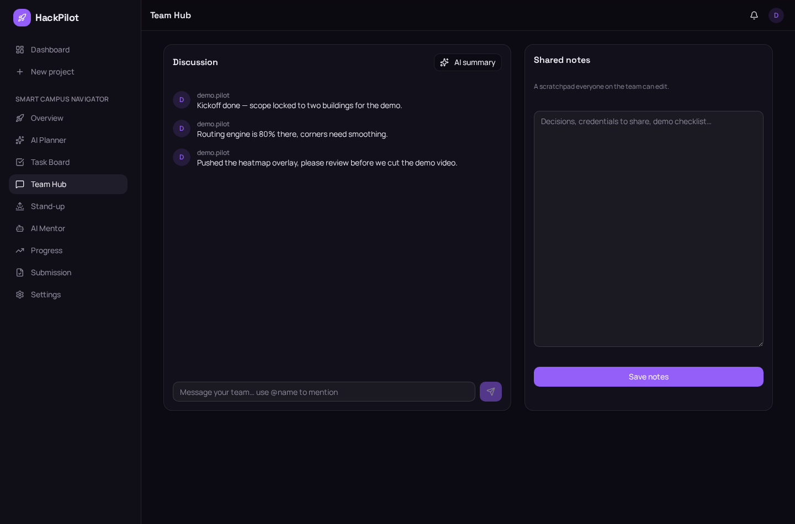

---

## 9. Daily Stand-up

Each teammate answers: what they finished, what they will do today, and any blockers. AI summarizes progress and flags risks.

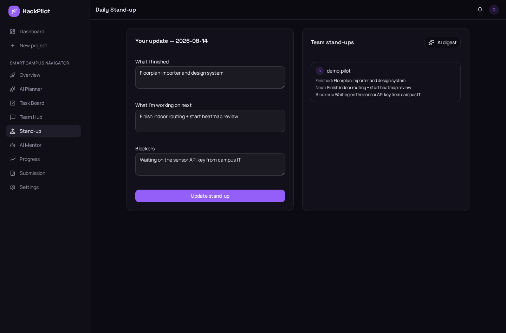

---

## 10. AI Mentor

A conversational AI mentor that helps brainstorm features, explain judging criteria, recommend priorities, and improve originality.

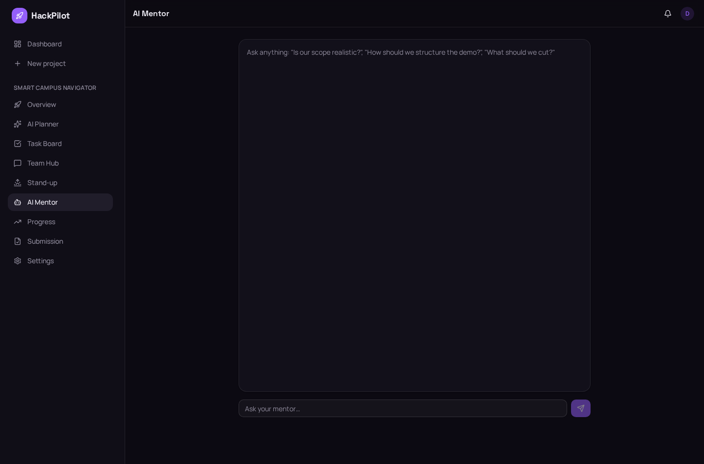

---

## 11. Progress Dashboard

Visual analytics showing task completion rate, work distribution across team members, status breakdown, and timeline progress.

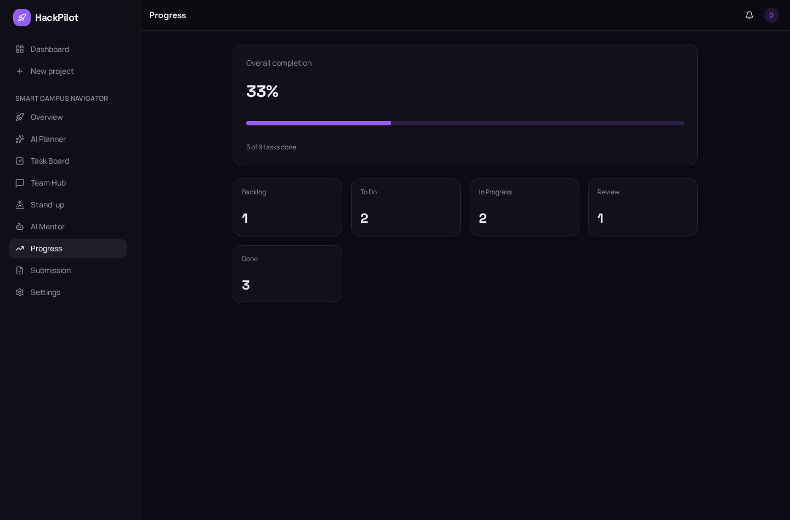

---

## 12. Submission Center

Generate submission-ready documents: README, Devpost submission, project overview, tech stack, demo script, and elevator pitch.

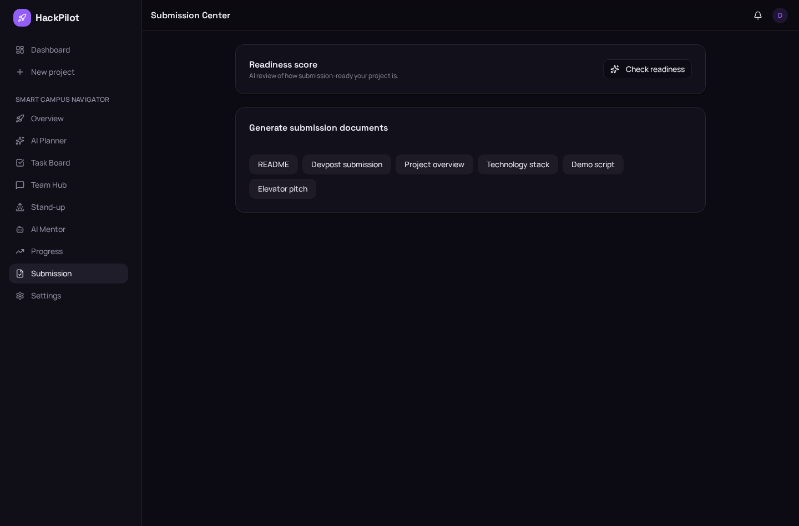

---

## 13. Settings

User profile settings for managing avatars, bios, and account preferences.

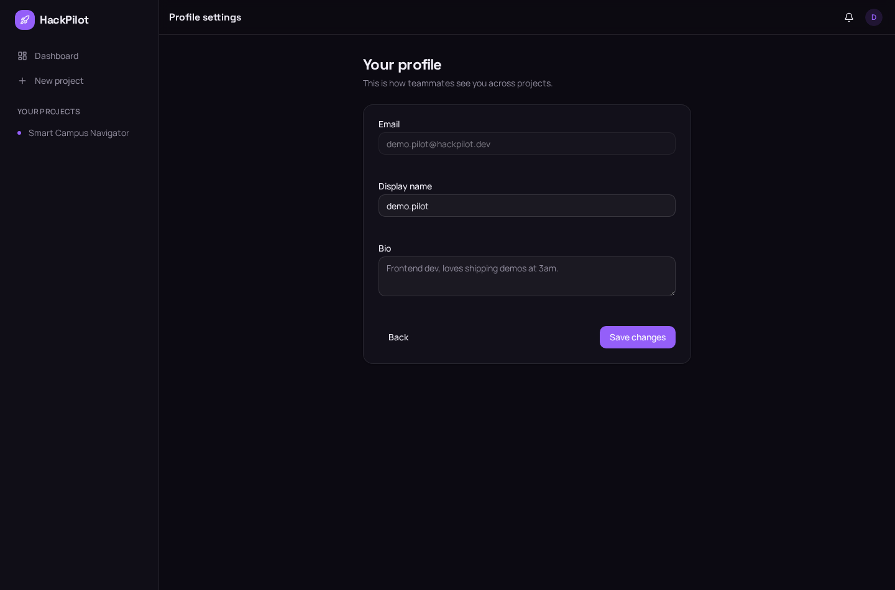

---

## Live Demo

Try HackPilot live at: [https://hackathon-ai-pilot.lovable.app](https://hackpilotai.lovable.app))
